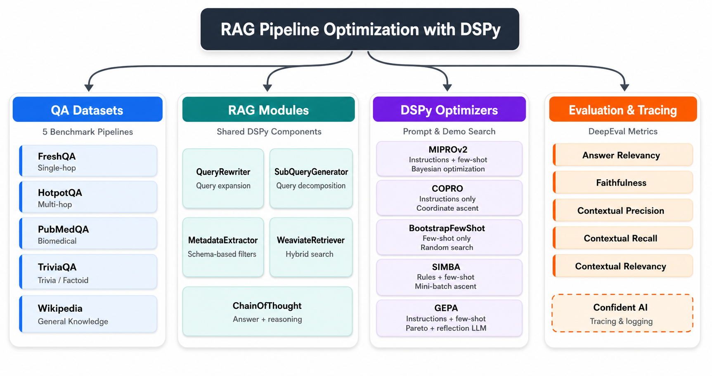
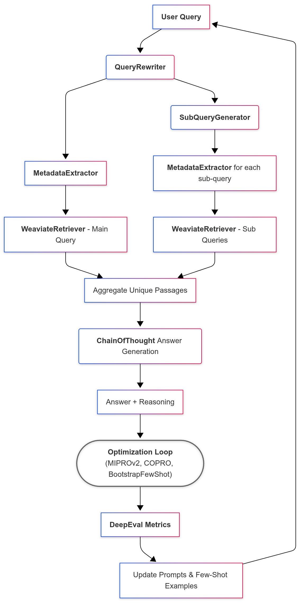

<h1 align="center"> <a href="https://github.com/avnlp/dspy-opt"> Advanced RAG Pipeline Optimization with DSPy </a> </h1>

<div align="center">

[](https://deepwiki.com/avnlp/dspy-opt)
[](https://github.com/avnlp/dspy-opt/actions/workflows/ci.yml)
[](https://github.com/avnlp/dspy-opt/actions/workflows/ci.yml)
[](https://github.com/avnlp/dspy-opt/actions/workflows/ci.yml)
[](https://github.com/avnlp/dspy-opt/actions/workflows/ci.yml)
[](https://github.com/avnlp/dspy-opt/actions/workflows/ci.yml)
[](https://codecov.io/github/avnlp/dspy-opt)
[](https://github.com/avnlp/dspy-opt/blob/main/LICENSE)

</div>

This repository implements several Retrieval-Augmented Generation (RAG) pipelines on diverse question answering datasets using the DSPy framework. The prompts and few-shot examples in the DSPy modules are optimized using the MIPRO, COPRO, BootstrapFewShot, SIMBA, and GEPA optimizers and DeepEval metrics.

The RAG pipelines are built using:

- [**DSPy**](https://dspy.ai/) for modular pipeline design and optimization.
- [**Weaviate**](https://weaviate.io/) vector database for hybrid search and retrieval.
- [**DeepEval**](https://deepeval.com/) for comprehensive evaluation metrics.
- [**Confident AI**](https://www.confident-ai.com/) for logging of metrics during optimization.

Each pipeline is configured through YAML files that allow for flexible customization of language models, embedding models, and optimizer hyperparameters.

<p align="center">
  
</p>

## Features

- **5 QA datasets** with diverse complexity - Single-hop, Multi-hop, Biomedical, Trivia, and General knowledge.
- **5 DSPy optimizers** - MIPROv2, COPRO, BootstrapFewShot, SIMBA, and GEPA.
- **Multi-stage RAG pipeline** - Query rewriting, Sub-Query Generation, Metadata Extraction, and Hybrid Retrieval.
- **DeepEval metrics integration** - Answer Relevancy, Faithfulness, Contextual Precision, Contextual Recall, and Contextual Relevancy.
- **YAML-driven configuration** for all pipelines, models, and optimizer hyperparameters
- **Confident AI tracing** and logging for evaluation runs

## Datasets

| Dataset | HuggingFace | Description | Complexity Type |
| :------ | :---------- | :---------- | :-------------- |
| FreshQA (SealQA) | [vtllms/sealqa](https://huggingface.co/datasets/vtllms/sealqa) | Dynamic QA benchmark with diverse question types and false-premise debunking | Single-hop |
| HotpotQA | [hotpotqa/hotpot_qa](https://huggingface.co/datasets/hotpotqa/hotpot_qa) | Multi-hop questions with strong supervision for supporting facts | Multi-hop |
| PubMedQA | [qiaojin/PubMedQA](https://huggingface.co/datasets/qiaojin/PubMedQA) | Biomedical QA based on PubMed abstracts | Biomedical |
| TriviaQA | [mandarjoshi/trivia_qa](https://huggingface.co/datasets/mandarjoshi/trivia_qa) | Question-answer-evidence triples authored by trivia enthusiasts | Trivia, factoid |
| Wikipedia | [wikimedia/wikipedia](https://huggingface.co/datasets/wikimedia/wikipedia) | Large-scale cleaned Wikipedia articles with [WikiQA](https://huggingface.co/datasets/microsoft/wiki_qa) for QA pairs | General knowledge |

## Pipeline Architecture



Each pipeline follows a consistent architecture with the following components:

- **Query Rewriting**: The initial `question` is passed to the `QueryRewriter` to generate a search-optimized query by expanding it with synonyms, clarifying ambiguous terms, and removing conversational noise.

- **Sub-Query Generation**: The rewritten query is then passed to the `SubQueryGenerator` to decompose it into multiple, more specific sub-queries. This breaks down multi-faceted questions into smaller, self-contained queries that can be executed in parallel, improving retrieval coverage.

- **Metadata Extraction**: The `MetadataExtractor` uses an LLM to parse both the rewritten query and each sub-query to extract structured metadata based on a predefined JSON schema. This structured metadata can then be used for filtering in the retriever to improve retrieval precision.

- **Document Retrieval**: The `WeaviateRetriever` is called for the main query and each sub-query, using the extracted metadata for filtering. It performs hybrid search combining vector search with keyword-based filtering. The results are aggregated into a single list of passages.

- **Answer Generation**: The unique, retrieved passages are fed into a `dspy.ChainOfThought` module to generate a final answer and the reasoning behind it.

- **Optimization**: DSPy optimizers automatically tune prompts and select few-shot examples by exploring the space of possible configurations and evaluating them using DeepEval metrics.

- **Logging**: Confident AI is used for logging of metrics during optimization.

## Optimizers

DSPy optimizers automatically improve the RAG pipeline by searching over **instructions** (prompt text inside DSPy modules) and/or **few-shot demonstrations** (examples selected or bootstrapped from the training set). All optimizers are driven by the DeepEval metrics evaluation loop, GEPA additionally requires a *reflection LLM* and a feedback-producing metric function.

- [**MIPROv2 (Multiprompt Instruction PROposal Optimizer v2)**](https://arxiv.org/abs/2406.11695) proposes candidate instruction variants and few-shot demo sets, then uses Bayesian optimization to efficiently explore combinations and converge on a high-scoring compiled program. It operates in three stages: (1) bootstrap few-shot example candidates, (2) propose grounded instruction candidates using dataset/code summaries, and (3) search over instruction–demo combinations via Bayesian optimization with mini-batch evaluation.

- [**COPRO**](https://dspy.ai/api/optimizers/COPRO/) performs instruction-only optimization via coordinate ascent. It iteratively proposes instruction edits across a breadth/depth schedule, evaluates each variant against the metric, and keeps changes that improve performance. Instructions are optimized independently per DSPy module.

- [**BootstrapFewShotWithRandomSearch**](https://dspy.ai/api/optimizers/BootstrapFewShotWithRandomSearch/) focuses purely on few-shot demo selection. It bootstraps candidate demonstrations by running the program on training examples and filtering for high-scoring traces, then runs random search over demo subsets to find the combination that maximizes the metric. Useful as a baseline before joint optimization.

- [**SIMBA (Stochastic Introspective Mini-Batch Ascent)**](https://dspy.ai/api/optimizers/SIMBA/)  samples mini-batches from the training set, identifies challenging examples with high output variability, then uses the LLM to introspectively generate self-reflective improvement rules or add successful examples as demonstrations. This batch-based approach is more efficient than full-eval search on larger datasets.

- [**GEPA (Genetic-Pareto)**](https://arxiv.org/abs/2507.19457) evolves prompts using a reflection-driven loop. A separate **reflection LLM** analyzes execution traces and textual feedback from the metric function, then proposes improved instructions. Candidates are managed via a **Pareto frontier** — retaining candidates that achieve the highest score on at least one evaluation instance — ensuring both exploration and retention of complementary strategies. GEPA supports candidate merging/crossover across lineages.

| Optimizer | What it tunes | Search strategy | Recommended for | Hyperparameters |
|---|---|---|---|---|
| **MIPROv2** | Instructions + Few-shot examples (jointly) | Bayesian optimization over candidate prompt/demo sets | Strong general-purpose default; sufficient search budget available | `max_bootstrapped_demos`, `max_labeled_demos`, `auto` |
| **COPRO** | Instructions only | Coordinate ascent over instruction variants | Quick prompt-only gains; testing whether instruction tuning alone helps | `breadth`, `depth`, `init_temperature` |
| **BootstrapFewShotWithRandomSearch** | Few-shot examples only | Random search over bootstrapped demo subsets | Measuring demo impact as a baseline before joint optimization | `max_bootstrapped_demos`, `max_labeled_demos`, `max_rounds` |
| **SIMBA** | Rules/instructions + few-shot examples | Mini-batch iterative ascent with self-reflective rule generation | Efficient batch-based optimization on larger training sets | `bsize`, `num_candidates`, `max_steps`, `max_demos` |
| **GEPA** | Instructions + few-shot examples (reflective evolution) | Pareto-based candidate selection with LLM reflection on failures | Reflection-driven improvements with multi-metric trade-offs | `max_full_evals`, `reflection_minibatch_size`, `candidate_selection_strategy`, `use_merge` |

## Components

### Query Rewriter

The QueryRewriter optimizes user queries for better retrieval performance.

- Rewrites queries to be more effective for search engines.
- Expands queries with relevant synonyms and concepts.
- Clarifies ambiguous terms and removes conversational noise.
- Maintains conciseness while preserving key entities and constraints.

### Sub-Query Generator

The SubQueryGenerator decomposes complex user queries into simpler, more focused sub-queries.

- Breaks down multi-faceted questions into smaller queries.
- Each sub-query addresses a distinct aspect of the original query.
- Sub-queries are self-contained for parallel search execution.
- Improves retrieval coverage for complex information needs.

### Metadata Extractor

The MetadataExtractor extracts structured metadata from text using a language model and a user-specified JSON schema.

- Uses LLMs with structured-output generation for metadata extraction.
- Dynamically converts JSON schema into validation structures.
- Only includes successfully extracted (non-null) fields in results.
- Extracted metadata is used for filtering during retrieval.

### Weaviate Retriever

The WeaviateRetriever connects to a Weaviate vector database for document retrieval.

- Performs hybrid search combining vector search with keyword-based filtering.
- Filters results based on extracted metadata.

### Metrics

The Metrics module integrates [DeepEval](https://deepeval.com/) evaluation metrics into the DSPy optimization framework.

- Creates metric functions compatible with DSPy optimizers.
- Evaluates pipeline performance using multiple metrics:
  - **Answer Relevancy**: Measures how relevant the answer is to the question.
  - **Faithfulness**: Ensures the answer is grounded in the retrieved context.
  - **Contextual Precision**: Evaluates precision of retrieved context.
  - **Contextual Recall**: Measures recall of retrieved context.
  - **Contextual Relevancy**: Assesses overall relevance of retrieved passages.
- Aggregates scores across metrics for optimization objectives.
- Supports async evaluation with configurable throttling.
- Provides two factory functions for optimizer compatibility:
  - `create_metrics_function()` returns a single **float** (averaged metric score), used by MIPROv2, COPRO, BootstrapFewShotWithRandomSearch, and SIMBA.
  - `create_gepa_metrics_function()` returns a `dspy.Prediction` containing both a numeric **score** and a per-metric **feedback** string. GEPA's reflection LLM consumes this textual feedback to diagnose failures and propose targeted prompt improvements — this is why GEPA requires a separate metric function.

## Installation

The project uses [uv](https://github.com/astral-sh/uv) for dependency management. First, ensure uv is installed:

```bash
# Install uv (if not already installed)
pip install uv
```

Then install the project dependencies:

```bash
# Install dependencies with all extras and dev dependencies
uv sync --all-extras --dev

# Activate the virtual environment
source .venv/bin/activate
```

### Environment Setup

Create a `.env` file in the project root with the required environment variables:

```env
WEAVIATE_URL=your_weaviate_cluster_url
WEAVIATE_API_KEY=your_weaviate_api_key
GROQ_API_KEY=your_groq_api_key
```

For tracing of evaluation runs:

Create a `.env.local` file in the project root and add your Confident AI API key:

```env
API_KEY=CONFIDENT_API_KEY
```

## Usage

### Indexing

Each dataset module includes an indexing script to process and store documents in the vector database. The indexing process:

1. Loads the dataset from Hugging Face.
2. Extracts metadata from each document using an LLM based on the metadata schema defined in the config file.
3. Generates vector embeddings using SentenceTransformer model.
4. Stores documents, embeddings, and metadata in Weaviate.

Example for FreshQA:

```bash
cd src/dspy_opt/freshqa
python freshqa_indexing.py
```

### Evaluation

Each dataset module includes an evaluation script to test the pipeline performance. The evaluation script:

1. Loads the pipeline from the saved state.
2. Runs predictions on the test dataset.
3. Evaluates using DeepEval metrics configured in the YAML file.
4. Reports aggregated scores and individual metric results.

Example for FreshQA:

```bash
cd src/dspy_opt/freshqa
python freshqa_rag_evaluation.py
```

### Programmatic Usage

```python
import dspy
from sentence_transformers import SentenceTransformer

from dspy_opt.freshqa.freshqa_rag_module import FreshQARAG
from dspy_opt.utils.metadata_extractor import MetadataExtractor
from dspy_opt.utils.query_rewriter import QueryRewriter
from dspy_opt.utils.sub_query_generator import SubQueryGenerator
from dspy_opt.utils.weaviate_retriever import WeaviateRetriever

# Configure the LLMs
answer_lm = dspy.LM("groq/qwen3-32b", api_key="your-groq-api-key")
extractor_lm = dspy.LM("groq/llama-3.3-70b-versatile", api_key="your-groq-api-key")
dspy.configure(lm=answer_lm)

# Initialize shared components
query_rewriter = QueryRewriter()
sub_query_generator = SubQueryGenerator()
metadata_extractor = MetadataExtractor(extractor_llm=extractor_lm)
embedding_model = SentenceTransformer("Qwen/Qwen3-Embedding-0.6B")

retriever = WeaviateRetriever(
    weaviate_url="your-weaviate-url",
    weaviate_api_key="your-weaviate-api-key",
    collection_name="FreshQA",
    top_k=5,
)

metadata_schema = {
    "properties": {
        "title": {"type": "string", "description": "The main title or name of the subject"},
        "category": {"type": "string", "description": "Primary category or type of content"},
    }
}

# Build and run the pipeline
pipeline = FreshQARAG(
    query_rewriter=query_rewriter,
    sub_query_generator=sub_query_generator,
    metadata_extractor=metadata_extractor,
    metadata_schema=metadata_schema,
    weaviate_retriever=retriever,
    embedding_model=embedding_model,
    top_k=5,
)

result = pipeline("What is the capital of France?")
print(result.answer)
print(result.reasoning)
```

### Pipeline Optimization

Each dataset module includes optimization scripts for different DSPy optimizers. The optimization process:

1. Loads the configuration from the YAML file (e.g., `freshqa_rag_mipro_config.yml`).
2. Initializes all DSPy modules (QueryRewriter, SubQueryGenerator, MetadataExtractor, WeaviateRetriever).
3. Loads the training and evaluation datasets.
4. Runs the optimizer to compile the pipeline with optimized prompts and few-shot examples.
5. Evaluates the optimized pipeline using DeepEval metrics.

Example for FreshQA RAG pipeline optimized using the MIPROv2 optimizer:

```bash
cd src/dspy_opt/freshqa
python freshqa_rag_mipro.py
```

SIMBA optimizer:

```bash
cd src/dspy_opt/freshqa
python freshqa_rag_simba.py
```

GEPA optimizer:

```bash
cd src/dspy_opt/freshqa
python freshqa_rag_gepa.py
```

## Documentation

- [Package overview](src/dspy_opt/README.md) - module map, extension points, and how to add a new dataset
- [Shared utilities](src/dspy_opt/utils/README.md) - QueryRewriter, SubQueryGenerator, MetadataExtractor, WeaviateRetriever, Metrics
- Dataset pipelines: [FreshQA](src/dspy_opt/freshqa/README.md) · [HotpotQA](src/dspy_opt/hotpotqa/README.md) · [PubMedQA](src/dspy_opt/pubmedqa/README.md) · [TriviaQA](src/dspy_opt/triviaqa/README.md) · [Wikipedia](src/dspy_opt/wikipedia/README.md)

## Project Structure

```text
src/dspy_opt/
├── utils/                          # Shared reusable components
│   ├── query_rewriter.py           # Query optimization module
│   ├── sub_query_generator.py      # Multi-query decomposition
│   ├── metadata_extractor.py       # Structured metadata extraction
│   ├── weaviate_retriever.py       # Hybrid Search retriever
│   └── metrics.py                  # DeepEval Metrics Integration
│
├── freshqa/                        # FreshQA dataset pipelines
│   ├── freshqa_indexing.py         # Index documents to Weaviate
│   ├── freshqa_indexing_config.yml
│   ├── freshqa_rag_module.py       # Complete RAG pipeline definition
│   ├── freshqa_rag_mipro.py        # MIPRO Optimization
│   ├── freshqa_rag_mipro_config.yml
│   ├── freshqa_rag_copro.py        # COPRO Optimization
│   ├── freshqa_rag_copro_config.yml
│   ├── freshqa_rag_bootstrap_few_shot.py
│   ├── freshqa_rag_bootstrap_few_shot_config.yml
│   ├── freshqa_rag_simba.py        # SIMBA Optimization
│   ├── freshqa_rag_simba_config.yml
│   ├── freshqa_rag_gepa.py         # GEPA Optimization
│   ├── freshqa_rag_gepa_config.yml
│   ├── freshqa_rag_evaluation.py   # Evaluate optimized pipeline
│   └── freshqa_rag_evaluation_config.yml
│
├── hotpotqa/                       # HotpotQA dataset pipelines
│   └── ... (similar structure)
│
├── triviaqa/                       # TriviaQA dataset pipelines
│   └── ... (similar structure)
│
├── pubmedqa/                       # PubMedQA dataset pipelines
│   └── ... (similar structure)
│
└── wikipedia/                      # Wikipedia dataset pipelines
    └── ... (similar structure)

tests/
├── conftest.py                     # Shared fixtures and external dependency stubs
├── helpers.py                      # Test doubles and mock classes
├── script_helpers.py               # Configuration and patching utilities
├── freshqa/
│   └── test_pipeline.py
├── hotpotqa/
│   └── test_pipeline.py
├── pubmedqa/
│   └── test_pipeline.py
├── triviaqa/
│   └── test_pipeline.py
├── utils/
│   └── test_pipeline.py
└── wikipedia/
    └── test_pipeline.py
```

## Contributing

Please see the [CONTRIBUTING.md](CONTRIBUTING.md) file for detailed contribution guidelines.

## References

- [DSPy](https://dspy.ai/) - Declarative framework for building modular AI software.
- [Weaviate](https://weaviate.io/) - Open-source vector search with Hybrid retrieval, collections, and multi-tenancy.
- [DeepEval](https://deepeval.com/) - Open-source evaluation framework for LLMs.
- [MIPROv2: Multi-prompt Instruction PRoposal Optimizer](https://arxiv.org/abs/2406.11695)
- [COPRO](https://dspy.ai/api/optimizers/COPRO/)
- [BootstrapFewShot](https://dspy.ai/api/optimizers/BootstrapFewShot/)
- [SIMBA: Stochastic Introspective Mini-Batch Ascent](https://dspy.ai/api/optimizers/SIMBA/)
- [GEPA: Genetic-Pareto](https://arxiv.org/abs/2507.19457)

## License

This project is licensed under the MIT License - see the [LICENSE](LICENSE) file for details.
